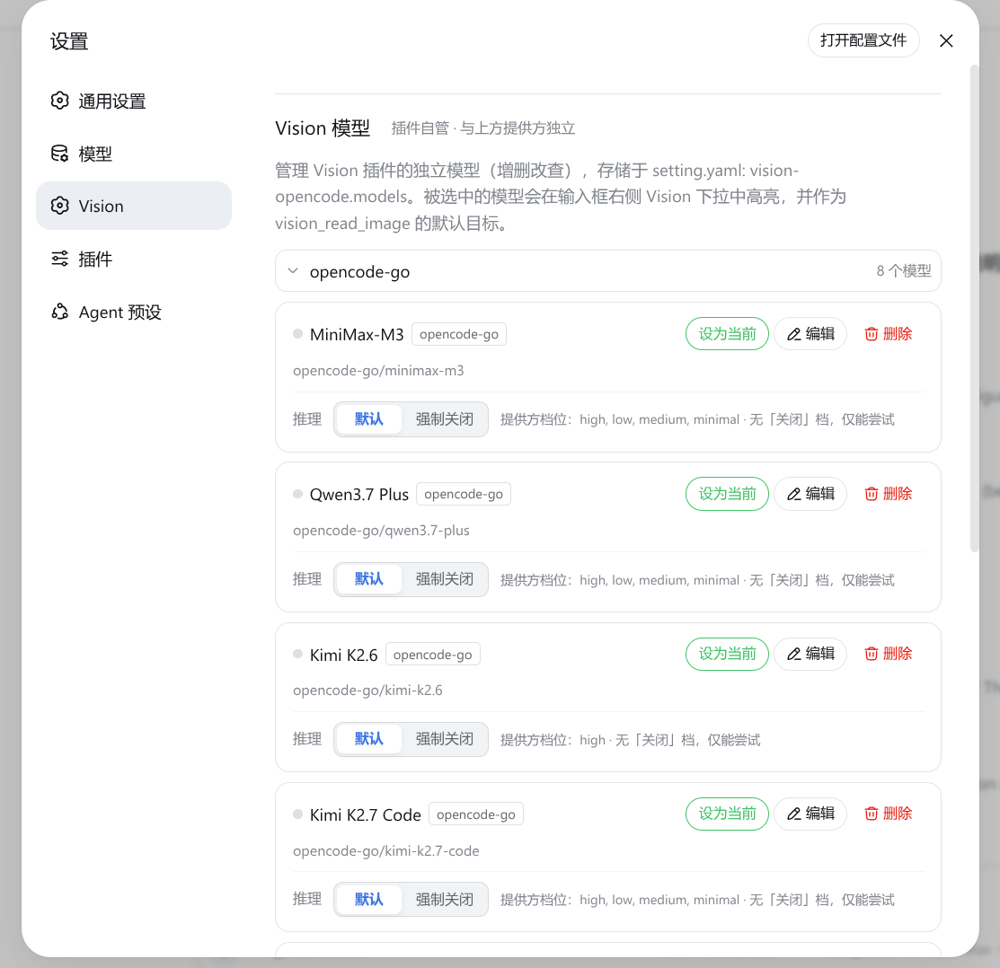

<div align="center">

# dsh-vision-opencode

[**中文**](https://github.com/poiuyjie/dsh-vision-opencode) ｜ [English](README.en.md)

</div>

> DeepSeek can't "see" images? OpenCode multimodal workaround: give your text-only main model a **configurable vision model**.

<p align="center">
  
</p>

## What it does

- Image pasted in chat → the vision model (e.g. MiMo-V2.5) converts it to text first, then your main model replies as usual — no model switch needed
- "Vision model" dropdown next to the input box, auto-listing every image-capable model across your providers
- Manage models under Settings → Vision; `vision_read_image` tool / `vision-image-analysis` skill for OCR, charts, screenshots
- Resilience: 60s per-call timeout, 1 retry, and a placeholder fallback so the turn never dies

## Install

Option 1 (native DSH, recommended):

```bash
dsh plugin --profile web add -w github:poiuyjie/dsh-vision-opencode
```

Option 2 — one-click script (`install.sh` Ubuntu / `install.ps1` Windows):

```bash
curl -fsSL https://raw.githubusercontent.com/poiuyjie/dsh-vision-opencode/main/scripts/install.sh | bash
```

Restart `dsh`, then pick a vision model in the dropdown.

Uninstall: `dsh plugin --profile web remove -w dsh-vision-opencode` (or uninstall.sh).

> Back up image conversations before uninstalling — old image chats may no longer reach a text-only main model afterwards.

## Configuration

Edit `~/.dsh/settings.yaml` (or use Settings → Vision):

```yaml
vision-opencode:
  provider: ''       # vision model provider; empty = not chosen
  model: ''          # vision model id; empty = not chosen
  autoConvert: true  # auto-convert toggle; set false if problems
```

Text-only main routes are auto-detected and get image conversion; native multimodal routes keep the stock DSH path.

## Turning off reasoning for the vision model

Each model has a "Reasoning" row in **Settings → Vision**:

| Option | Meaning |
|---|---|
| Default | Follow the provider's default level — think normally |
| Off | No thinking — faster and cheaper. Only when the provider **really declares** off (e.g. hy3 `off:"none"`) |
| Force off | Best-effort at disabling thinking (e.g. `reasoning_effort:"none"`), **not guaranteed**; models without a declared off (like MiMo) get this |

Very few models have a real "Off" entry; the rest show "Default / Force off" with a "not guaranteed" note. Turning thinking off usually cuts first-token latency and cost (MiMo is verified to stop thinking with `reasoning_effort:"none"`).

<p align="center">
  
</p>

> ⚠️ Providers declare "turning off thinking" very inconsistently (`off:"none"` / `off:null` / no field). The plugin can only tell "Off" from "Force off" per each catalog and best-effort a disabling param — **no guarantee every provider can actually disable thinking**.

## FAQ

- Disable auto-convert only (keep tool + selector): set `vision-opencode.autoConvert: false` and restart
- Conversion fails / selector missing: usually no vision model picked or a version mismatch — check the browser console and file an issue
- Text-only vs native multimodal routes are auto-distinguished; no config sync on provider/model switches

## Development

- **Always tag before pushing**: create and push a version tag for every push (e.g. `git tag v0.4.0 && git push origin v0.4.0`) so every remote update carries a traceable version marker.

## License

MIT
