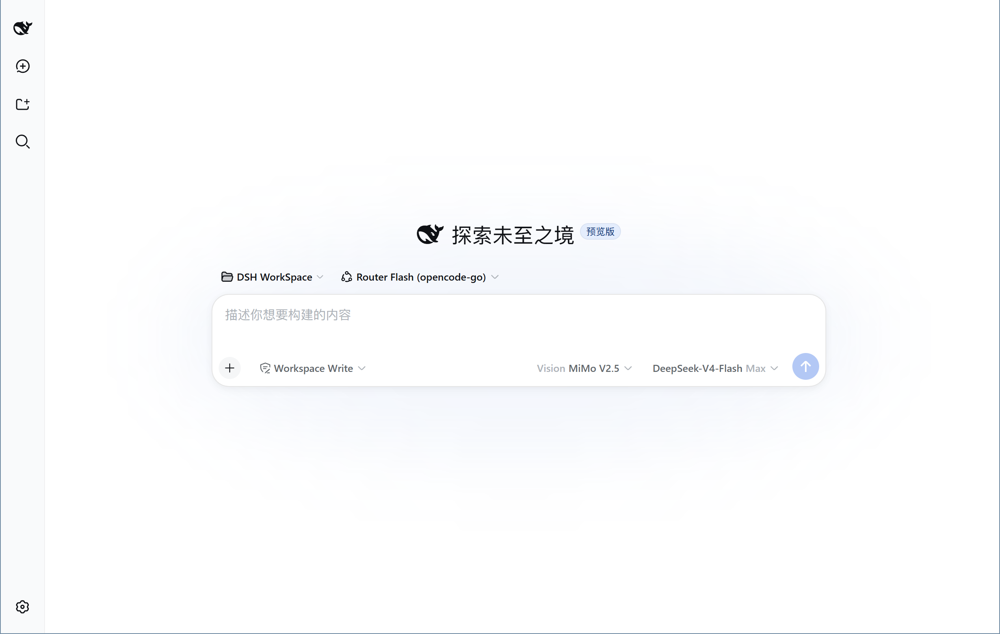

<div align="center">

# dsh-vision-opencode

[中文](https://github.com/poiuyjie/dsh-vision-opencode) ｜ [**English**](README.en.md)

*点击上方链接切换语言 · Click the links above to switch languages*

</div>

> **DeepSeek can't see images? Here's an OpenCode-powered multimodal drop-in alternative.**

<p align="center">
  
</p>

A plugin for DeepSeek Harness (DSH) that adds a **configurable vision model** alongside your text-only main model. Your main model (e.g. DeepSeek) can't read images? No problem — images are first understood by a vision model (e.g. MiMo-V2.5) and turned into text, which is then handed to your main model. You never have to swap out your primary model.

- A "vision model" dropdown next to the input box (auto-lists every image-capable model across providers), styled after the official DSH model selector (group headings, trailing check mark, arrow-key navigation, retry-on-failure, toast), with a "Vision" prefix on the trigger
- A dedicated **Vision** settings section (Settings → Vision) with official-style provider cards for the plugin-owned vision-model catalog, decoupled from the system model list
- A runtime `vision-image-analysis` skill that guides the main model to call `vision_read_image` for OCR, charts, screenshots, and scenes; it gracefully falls back to tool and prompt guidance when DSH's skill service is absent
- **Auto-conversion** for chat attachments, with ephemeral progress shown in the selector trigger's "Vision" slot (official-style shimmer while running) and one native DSH `notice` retained only when analysis completes or fails
- Automatically detects text-only routes from each adapter's catalog; native multimodal main models retain DSH's native image handling, with no second route list to keep in sync
- Fault tolerance: 60s per-call timeout, one automatic retry for retriable failures, and a graceful placeholder-text fallback when retries are exhausted (the main model still answers and tells the user)
- Admits image submission through an in-process capability layer across pi-ai, `deepseek-official`, and other adapters without modifying the user's model catalog

## Supported Systems

Native installers are provided for both supported environments:

- **Ubuntu 24.04 / Bash**: `scripts/install.sh` and `scripts/uninstall.sh` (locally tested).
- **Windows 10/11 / PowerShell 5.1+**: `scripts/install.ps1` and `scripts/uninstall.ps1` (Git Bash and WSL are not required).

Both variants implement the same configuration merge, Cordis registration, idempotent update, and uninstall cleanup behavior. macOS and other distributions remain unverified.

> Compatibility: built and verified against **DSH `0.1.0-rc.6`**. It relies on two undocumented runtime behaviors — agent-loop requests deep-frozen in the `llm/stream` waterfall, and cordis waterfall `next()` replaying original arguments. If DSH behavior changes in a later rc, upgrade this plugin or turn off the `autoConvert` escape hatch (see below).

## One-click Install

```bash
curl -fsSL https://raw.githubusercontent.com/poiuyjie/dsh-vision-opencode/main/scripts/install.sh | bash
```

### Windows PowerShell

```powershell
$install = Invoke-RestMethod 'https://raw.githubusercontent.com/poiuyjie/dsh-vision-opencode/main/scripts/install.ps1'
& ([scriptblock]::Create($install))
```

Restart `dsh`, refresh the browser page, then choose a vision model next to the composer.

## One-click Uninstall

Ubuntu:

```bash
curl -fsSL https://raw.githubusercontent.com/poiuyjie/dsh-vision-opencode/main/scripts/uninstall.sh | bash
```

Windows PowerShell:

```powershell
$uninstall = Invoke-RestMethod 'https://raw.githubusercontent.com/poiuyjie/dsh-vision-opencode/main/scripts/uninstall.ps1'
& ([scriptblock]::Create($uninstall))
```

> **Important: back up image conversations first.** After uninstalling, old conversations that contain images may no longer be usable with a text-only main model. Before uninstalling, copy or export key conclusions, image descriptions, code, and TODOs to a Markdown (`.md`) file. The plugin does not automatically convert or rewrite the original image history.

> The installer never selects or writes a vision model, and no main-model route is required. At runtime the plugin reads each adapter's declared input capability and converts only text-only routes. Add `--proxy` or `-Proxy` only when needed.
>
> Existing `mainProvider/mainModels` values remain compatible as legacy hints, but they no longer need to be updated when you switch models.
>
> Uninstall only handles legacy gate entries proven by a non-empty `gateState`; it never scans or changes image-model settings owned by users or other plugins.

## Manual Install

### Option A: Install from GitHub

```bash
cd ~/.dsh/profiles/web
pnpm add -w github:poiuyjie/dsh-vision-opencode
# Newer DSH profile dirs are pnpm workspace roots (they contain pnpm-workspace.yaml),
# so -w is required; drop -w on older DSH without that file.
```

### Option B: Install from npm

> ⚠️ Not published to npm yet (the package does not exist on the registry). Once published, the shorter command below will work:

```bash
cd ~/.dsh/profiles/web
pnpm add -w dsh-vision-opencode   # not available yet — use Option A for now; -w as above
```

## Register in cordis

Edit `~/.dsh/profiles/web/cordis.patch.yml` and append:

```yaml
- insert:
    - id: vision-opencode
      name: 'dsh-vision-opencode'
```

> If the file contains an empty-array placeholder line `[]` (left by the one-click uninstall script), delete it before appending — `[]` followed by an entry is parsed as two YAML documents and dsh will fail to boot.

## Configuration

Edit `~/.dsh/settings.yaml`:

```yaml
vision-opencode:
  provider: ''              # currently selected vision model provider; empty = not chosen (selector shows 「识图模型」)
  model: ''                 # currently selected vision model id; empty = not chosen (written back once you pick from the dropdown)
  autoConvert: true         # auto-convert toggle (stability escape hatch; set false if problems)
  # mainProvider/mainModels: legacy compatibility fields; optional
```

Restart `dsh`. A "vision model" dropdown appears next to the input box — it auto-lists every image-capable model across your providers; it shows a 「识图模型」 placeholder until you pick one, and your pick is written back into settings.

> Graphical configuration: open **Settings → Vision** (a dedicated tab next to "Model") to manage the plugin-owned vision models and set the current one; you can also edit `settings.yaml` directly and restart.

Chat attachments and workspace images use complementary paths. Attachments must be converted before a text-only main request is sent, so progress appears temporarily in the vision-model trigger (replacing the "Vision" prefix) and only one final `vision-opencode` context record remains. For a later workspace path, screenshot, chart, or OCR task, the model can load the `vision-image-analysis` skill, call `vision_read_image`, and show its native tool card. Both paths use any multimodal provider/model selected in the dropdown; OpenCode Go is not required.

`autoConvert` applies to every route that DSH declares as text-only. The plugin re-reads capabilities after a provider/model switch; native multimodal routes retain their original image path.

<details>
<summary>Advanced: manual uninstall</summary>

## Manual Uninstall (Advanced)

```bash
# 1. With dsh running, self-clean once: clear plugin settings and restore legacy plugin-owned modelOverrides
curl -X POST -H 'x-vision-opencode-action: uninstall' http://127.0.0.1:3080/vision-opencode/uninstall

# 2. Stop dsh (Ctrl+C)

# 3. Remove the dependency and registration entry
cd ~/.dsh/profiles/web
pnpm remove dsh-vision-opencode
#    Edit cordis.patch.yml and remove the vision-opencode insert entry (if only comments remain, replace the file with [])

# 4. Restart dsh
```

> After step 1, `settings.yaml` may keep a single leftover line `vision-opencode: {}` (the placeholder of cleared plugin settings) — harmless; you can delete it in step 3. The one-click uninstall script removes it for you.

The current version creates no new `modelOverrides`. When upgrading with a non-empty legacy `gateState`, keep dsh running and complete step 1 first. The uninstaller never guesses ownership or deletes unclaimed user settings.

</details>

A plugin load failure won't take DSH down: the cordis loader isolates per entry — a failed plugin shows as failed in "Settings → Plugins" while everything else keeps working.

## Error Handling Matrix

| Situation | Behavior |
|---|---|
| Rate-limit / timeout / 5xx / transport errors on the vision call | Retry once after 800ms backoff (2 attempts total) |
| Non-retriable failures (AUTH/4xx, etc.) | No retry; fall back immediately |
| Retries exhausted (auto-convert path) | Fall back to placeholder text; the main model still answers and informs the user |
| Retries exhausted (`vision_read_image` tool path) | Tool result is `isError` (benign); the main model continues |
| A single call hangs | Independent 60s timeout per attempt |
| User cancels the turn | Abort immediately; no pointless fallback |
| Unexpected plugin bug | Last resort: all images degrade to placeholder text; the turn is never killed |
| Provider or model is switched | Reads the new route capability automatically and preserves native multimodal handling |

## Rollback / Escape Hatch

- To only disable auto-conversion (keep the tool and selector): set `vision-opencode.autoConvert: false` in `settings.yaml` and restart.
- Full rollback: run the uninstall flow above. After rollback, behavior equals the uninstalled state (image messages are normally rejected by DSH's gate and never hit the API).

## Known Limitations

- The frontend selector is a hand-written DSH client bundle (`window.__ModuleLoader__` format); the client interface may change between rc releases. If the selector doesn't appear, open the browser console and file the error as an issue.
- Auto-conversion happens at request time; the analyzed text is not written into the persistent session log (it can still survive session compaction, since compaction requests pass through the same conversion waterfall).
- Non-pi-ai routes such as `deepseek-official` rely on DSH's current runtime `resolveModelInfo()` interface. A future change to DSH's image-admission implementation may require a plugin update.
- Version 0.2.x did not record gate ownership. Unclaimed historical `modelOverrides` require review against their real prior values; the plugin never deletes entries based on guessed model names.

## License

MIT
